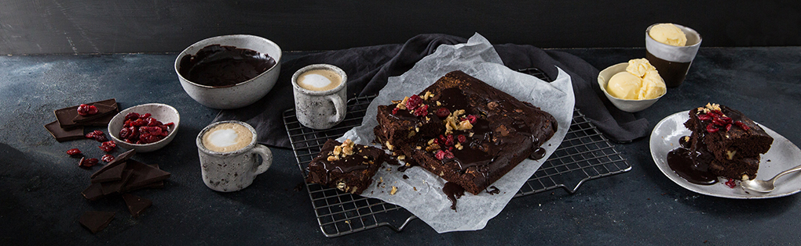

# DOUBLE CHOCOLATE MOCHA BROWNIE

-----

## DESCRIPTION:
We didn’t think you could improve a chocolate brownie – ‘til we added more chocolate and a hit of Foreign Ground coffee.
**Makes: 24**

-----

### INGREDIENTS:
* 1/3 cup (80ml) strong brewed Foreign Ground coffee
* 1 cup (250ml) butter, at room temperature
* 1 slab (80g) dark chocolate, chopped
* 1 slab (80g) white chocolate, chopped
* ½ tub (125g) dark chocolate ganache*
* 100g raw Padkos walnuts, chopped
* 1 1/2 cups (375ml) demerara sugar
* 1 1/4 cups (310ml) cocoa powder
* ½ tsp. (3ml) bicarbonate of soda
* 100 g Padkos dried cranberrie
* 2 tsp. (10ml) vanilla extract
* 1 cup (250ml) flour
* 1 tsp. (5ml) salt
* 4 eggs

### METHOD:

1. Pre-heat oven to 180C and grease a 33x22 cm (13x9 inch) brownie pan with oil or butter.
2. Cream butter with sugar in medium mixing bowl. Add eggs, vanilla, salt, bicarbonate of soda and mix well.
3. Stir in flour, cocoa powder, and coffee until batter is smooth. Fold through 1/2 of the dark chocolate chunks and walnuts and all of the white chocolate chunks.
4. Scrape batter into the prepared pan and sprinkle remaining dark chocolate and walnuts over the top. Bake for 25-30 minutes or until an inserted toothpick comes out clean.
5. Serve topped with chocolate ganache, cranberries and scoops of vanilla ice-cream.
