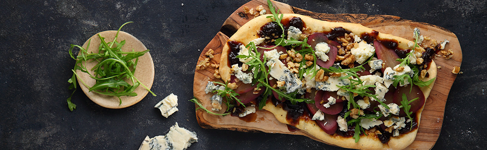

# GORGONZOLA, PEAR & WALNUT FLATBREAD

-----

## DESCRIPTION:
The *exclusive* Italian Arrigoni Gorgonzola Piccante is a complex & powerful double gold award-winning cheese champion. The intense flavour of this exceptional cheese adds a kick to the sweetness of the poached pears in this Gorgonzola, Pear & Walnut Flatbread.
**Serves: 4**

-----

### INGREDIENTS:
* 1 bottle (750ml) red wine
* 1 cup (250ml) sugar
* 3 cinnamon quills
* 6 thyme sprigs
* 2 star anise
* 4 medium pears, peeled
* 400g readymade bread dough
* 3 Tbsp. (45ml) flour
* Olive oil, for drizzling
* Salt and Pepper
* 1 x jar Nataniël Collection onion marmalade
* 1 x 150g Arrigoni Gorgonzola
* 80g Padkos walnuts, chopped
* 30g wild rocket

### METHOD:

1. **To make the poached pears:** Place red wine, sugar, cinnamon, thyme and star anise into a pot and heat gently until sugar has dissolved.
2. Bring to a simmer and poach pears for about 20 minutes or until tender. Allow to cool in the poaching liquid. Once pears have cooled, slice thinly and set aside.
3. Preheat your oven to 200 °C and divide the bread dough into 4 equal balls.
4. Lightly dust a clean surface with a little flour and roll each ball of dough out as thinly as possible, into an oval shape.
5. Place each base onto a baking tray lined with baking paper, drizzle with a little olive oil and season with salt and pepper.
6. Bake in oven for about 10 minutes or until golden brown and crisp. Remove from oven and set aside to cool.
7. **To assemble:** Smear each flatbread with 2 heaped tablespoons of onion marmalade and top with sliced poached pears. *Crumble over Gorgonzola, scatter with chopped walnuts, top with wild rocket and serve.*