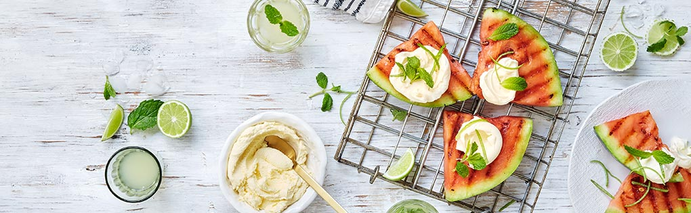

# BRAAIED WATERMELON WITH MOJITO CREAM

-----

## DESCRIPTION:
The *exclusive* Italian Arrigoni Gorgonzola Piccante is a complex & powerful double gold award-winning cheese champion. The intense flavour of this exceptional cheese adds a kick to the sweetness of the poached pears in this Gorgonzola, Pear & Walnut. 
**Serves: 8**

-----

### INGREDIENTS:
* 1 medium sized watermelon, cut into wedges
* 1/3 cup (80ml) fresh lime juice
* 1/3 cup (80ml) mint, finely chopped
* 1 tub (250g) mascarpone, at room temperature
* Limes wedges and mint leaves, to serve

### METHOD:

1. Mix mascarpone, mint and half the lime juice together.
2. Braai the watermelon wedges over hot coals until lightly charred on both sides. Drizzle with the remaining lime juice.
3. Serve watermelon wedges with the mascarpone, extra lime wedges and mint leaves.